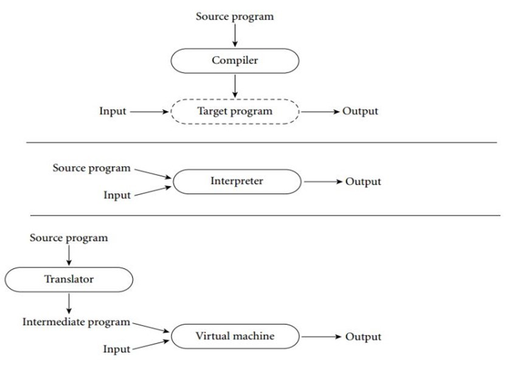
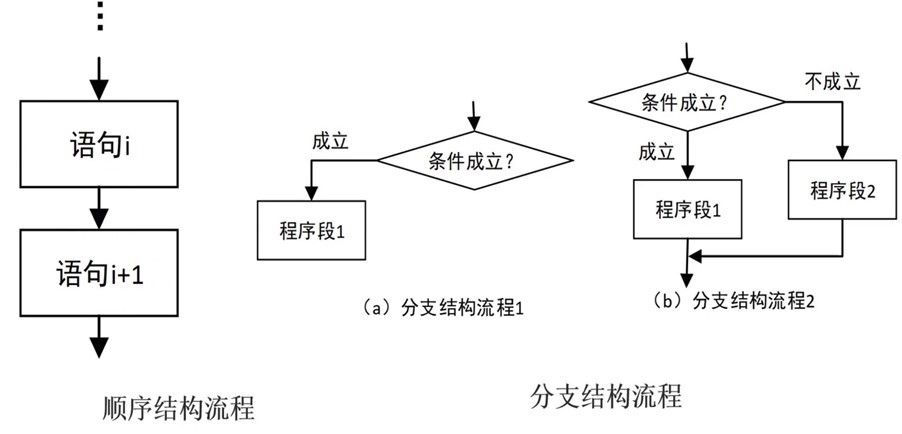
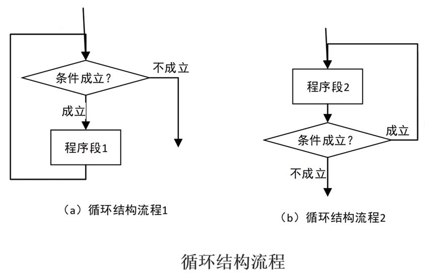
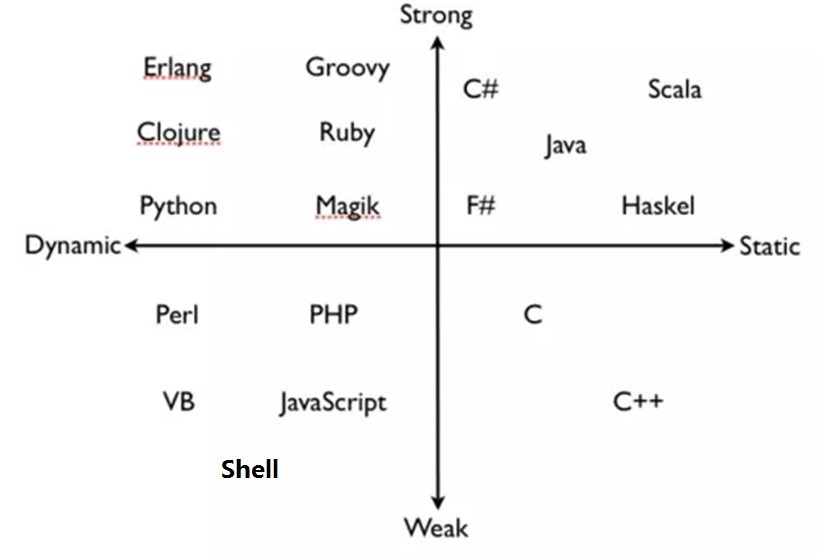
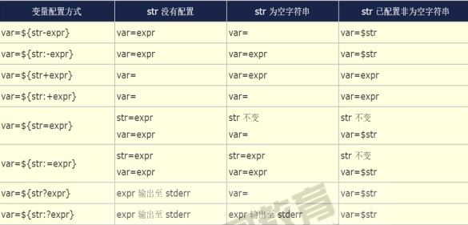

# shell 脚本编程

**内容概述**

- 编程基础
- 脚本基本格式
- 变量
- 运算
- 条件测试
- 配置用户环境
- 循环
- 信号捕捉
- 函数
- 数组
- 高级字符串操作
- 高级变量
- expect

## 编程基础 

Linus：Talk is cheap，show me the code。

### 程序组成

程序：算法+数据结构

数据：是程序的核心

算法：处理数据的方式

数据结构：数据在计算机中的类型和组织方式

### 程序编程风格

- 过程式：以指令为中心，数据服务于指令，shell脚本程序提供了编程能力，解释执行。
- 对象式：以数据为中心，指令服务于数据，java，C#，python等。

### 编程语言

计算机：运行二进制指令

编程语言：人与计算机之间交互的语言。分为两种：低级语言和高级语言。

- 低级编程语言：

  机器：二进制的0和1的序列，称为机器指令。与自然语言差异太大，难懂、难写。

  汇编：用一些助记符号替代机器指令，称为汇编语言。

  ​			如：ADD A,B 将寄存器A的数与寄存器B的数相加得到的数放到寄存器A中。

  ​			汇编语言写好的程序需要汇编程序转换成机器指令。

  ​			汇编语言稍微好理解，即机器指令对应的助记符，助记符更接近自然语言。

- 高级编程语言： 

  编译：高级语言-->编译器-->机器代码文件-->执行，如：C，C++。

  解释：高级语言-->执行-->解释器-->机器代码，如：shell，python，php，JavaScript，perl。

编译和解释型语言



### 编程逻辑处理方式





**三种处理逻辑**

- 顺序执行
- 选择执行
- 循环执行

## shell脚本语言的基本结构

### shell脚本的用途

- 自动化常用命令
- 执行系统管理和故障排除
- 创建简单的应用程序
- 处理文本或文件

### shell脚本基本结构

shell脚本编程：是基于过程式、解释执行的语言。

编程语言的基本结构：

- 各种系统命令的组合
- 数据存储：变量、数组
- 表达式：a + b
- 控制语句：if

shell脚本：包含一些命令或声明，并符合一定格式的文本文件。

格式要求：首行shebang机制

```shell
#!/bin/bash
#!/usr/bin/python
#!/usr/bin/perl 
```

### 创建shell脚本过程

第一步：使用文本编辑器来创建文本文件

第一行必须包括shell声明序列：#!

示例：

```shell
#!/bin/bash
```

添加注释,注释以#开头

第二步：加执行权限

给予执行权限，在命令行上指定脚本的绝对或相对路径

第三步：运行脚本

直接运行解释器，将脚本作为解释器程序的参数运行

### 脚本注释规范

1. 第一行一般为调用使用的语言
2. 程序名，避免更改文件名为无法找到正确的文件
3. 版本号
4. 更改后的时间
5. 作者相关信息
6. 该程序的作用，及注意事项
7. 最后是各版本的更新简要说明

### 第一个脚本

```shell
#!SHEBANG
CONFIGURATION_VARIABLES
FUNCTION_DEFINITIONS
MAIN_CODE
```

shell脚本范例：

```shell
#!/bin/bash
# ------------------------------------------
# Filename:     backfiles.sh
# Version:      1.0
# Date:         
# Author:       
# Description:  备份文件或者目录
# ------------------------------------------

echo -e "\033[1;32mStarting backup...\033[0m"
sleep 2
cp -a /etc/nginx /data/nginxconf-`date +%F`/
echo -e "\033[1;32mBackup is finished\033[0m"
```

### 脚本调试

检测脚本中的语法错误

```shell
bash -n /path/to/some_script
```

调试执行

```shell
bash -x /path/to/some_script
```

### 变量

#### 变量

变量表示命名的内存空间，将数据放在内存空间中，通过变量名引用，获取数据。

#### 变量类型

 变量类型：

- 内置变量，如：PS1，PATH，HISTSIZE
- 用户自定义变量

不同的变量存放的数据不同，决定了以下

1. 数据存储方式
2. 参与的运算
3. 表示的数据范围

变量数据类型：

- 字符 
- 数值：整型、浮点型,bash 不支持浮点数

#### 编程语言分类



**静态和动态语言**

- 静态编译语言：使用变量前，先声明变量类型，之后类型不能改变，在编译时检查，如：java，c。
- 动态编译语言：不用事先声明，可随时改变类型，如：bash，Python。

**强类型和弱类型语言** 

- 强类型语言：不同类型数据操作，必须经过强制转换才同一类型才能运算，如java ，c#。

  python

  如：以下python代码

  print('magedu'+ 10)	提示出错，不会自动转换类型

  print('magedu'+str(10))	结果为magedu10，需要显示转换类型 

- 弱类型语言：语言的运行时会隐式做数据类型转换。无须指定类型，默认均为字符型；参与运算会自动进行隐式类型转换；变量无须事先定义可直接调用。如：bash ，php，javascript 

#### Shell中变量命名法则

- 不能使程序中的保留字：如：if, for
- 只能使用数字、字母及下划线，且不能以数字开头，注意：不支持短横线 “ - ”
- 见名知义，用英文名字，并体现出实际作用
- 统一命名规则：驼峰命名法, studentname,大驼峰StudentName,小驼峰studentName
- 变量名大写
- 局部变量小写
- 函数名小写

#### 变量定义和引用

变量的生效范围等标准划分变量类型

- 普通变量：生效范围为当前shell进程；对当前shell之外的其它shell进程，包括当前shell的子shell 进程均无效
- 环境变量：生效范围为当前shell进程及其子进程
- 本地变量：生效范围为当前shell进程中某代码片断，通常指函数

**变量赋值**

```shell
name='value'
```

value 可以是以下多种形式

```shell
直接字串：name='root'
变量引用：name="$USER"
命令引用：name=`COMMAND` 或者 name=$(COMMAND)
```

**变量引用：**

```shell
$name
${name} 
```

弱引用和强引用

- "$name " 弱引用，其中的变量引用会被替换为变量值
- '$name ' 强引用，其中的变量引用不会被替换为变量值，而保持原字符串

显示已定义的所有变量：

```shell
set
```

**删除变量：**

```shell
unset name
```

范例：

```shell
#!/bin/bash
# ------------------------------------------
# Filename:     systeminfo.sh
# Version:      1.0
# Date:         
# Author:       
# Description:  查询系统信息
# ------------------------------------------
COLOR="\033[1;31m"
END="\033[0m"
echo -e "\033[1;32m-----------------Host systeminfo---------------$END"
echo -e "HOSTNAME:     $COLOR`hostname`$END"
echo -e "IPADDR:       $COLOR` ifconfig ens192|grep -Eo '([0-9]{1,3}\.){3}[0-9]{1,3}' |head -n1`$END"
echo -e "OSVERSION:    $COLOR`cat /etc/redhat-release`$END"
echo -e "KERNEL:       $COLOR`uname -r`$END"
echo -e "CPU:          $COLOR`lscpu|grep 'Model name'|tr -s ' '|cut -d : -f2`$END"
echo -e "MEMORY:       $COLOR`free -h|grep Mem|tr -s ' ' : |cut -d : -f2`$END"
echo -e "DISK:         $COLOR`lsblk |grep '^sd' |tr -s ' ' |cut -d " " -f4`$END"
```

#### 环境变量

变量声明和赋值：

```shell
export name=VALUE
declare -x name=VALUE
```

变量引用：

```shell
$name
${name}
```

显示所有环境变量：

```shell
env
printenv
export
declare -x
```

bash内建的环境变量

```shell
PATH
SHELL
USER
UID
HOME
PWD
SHLVL
LANG
MAIL
HOSTNAME
HISTSIZE
_   下划线 表示前一命令的最后一个参数
```

#### 只读变量

只读变量：只能声明定义，但后续不能修改和删除

声明只读变量：

```shell
readonly name
declare  -r name
```

查看只读变量：

```shell
readonly [-p]
declare -r
```

#### 位置变量

位置变量：在bash shell中内置的变量, 在脚本代码中调用通过命令行传递给脚本的参数

```shell
$1, $2, ... 对应第1个、第2个等参数，shift [n]换位置
$0 命令本身,包括路径
$* 传递给脚本的所有参数，全部参数合为一个字符串
$@ 传递给脚本的所有参数，每个参数为独立字符串
$# 传递给脚本的参数的个数
注意：$@ $* 只在被双引号包起来的时候才会有差异
```

清空所有位置变量

```shell
set --
```

#### 退出状态码变量

进程执行后，将使用变量 $? 保存状态码的相关数字，不同的值反应成功或失败，$?取值范例 0-255 

```shell
$?的值为0 代表成功
$?的值是1到255   代表失败
```

范例：

```shell
ping -c1 -W1 hostdown &> /dev/null 
echo $?
```

用户可以在脚本中使用以下命令自定义退出状态码

```shell
exit [n]
```

注意：

- 脚本中一旦遇到exit命令，脚本会立即终止；终止退出状态取决于exit命令后面的数字
- 如果未给脚本指定退出状态码，整个脚本的退出状态码取决于脚本中执行的最后一条命令的状态码

#### 展开命令行

**展开命令执行顺序**

```shell
把命令行分成单个命令词
展开别名
展开大括号的声明（{}）
展开波浪符声明（~）
命令替换$() 和 ``
再次把命令行分成命令词
展开文件通配（*、?、[abc]等等）
准备I/0重导向（<、>）
运行命令
```

**防止扩展**

```
反斜线（\）会使随后的字符按原意解释
```

范例：

```shell
echo Your cost: \$5.00 
Your cost: $5.00
```

**加引号来防止扩展**

```shell
单引号（’’）防止所有扩展
双引号（”“）也可防止扩展，但是以下情况例外：$（美元符号）
```

变量扩展

```shell
`` : 反引号，命令替换
\：反斜线，禁止单个字符扩展
!：叹号，历史命令替换
```

#### 脚本安全和set

set 命令：可以用来定制shell环境

$- 变量

- h：hashall，打开选项后，Shell 会将命令所在的路径hash下来，避免每次都要查询。通过set +h将h选项关闭。
- i：interactive-comments，包含这个选项说明当前的 shell 是一个交互式的 shell。所谓的交互式shell, 在脚本中，i选项是关闭的。
- m：monitor，打开监控模式，就可以通过Job control来控制进程的停止、继续，后台或者前台执行等。
- B：braceexpand，大括号扩展。
- H：history，H选项打开，可以展开历史列表中的命令，可以通过!感叹号来完成，例如“!!”返回上最近的 一个历史命令，“!n”返回第 n 个历史命令

set 命令实现脚本安全

options：

-u 在扩展一个没有设置的变量时，显示错误信息， 等同set -o nounset

-e 如果一个命令返回一个非0退出状态值(失败)就退出， 等同setn -o errexit

-o option 显示，打开或者关闭选项

​		显示选项：set -o

​		打开选项：set -o 选项

​		关闭选项：set +o 选项

-x 当执行命令时，打印命令及其参数,类似 bash -x 

### 格式化输出 printf

格式

```shell
printf "指定的格式" "文本1" "文本2"…
```

**常用格式替换符**

| 替换符 | 功能                                                         |
| ------ | ------------------------------------------------------------ |
| %s     | 字符串                                                       |
| %f     | 浮点格式                                                     |
| %b     | 相对应的参数中包含转义字符时，可以使用此替换符进行替换，对应的转义字符会被转义 |
| %c     | ASCII字符，即显示对应参数的第一个字符                        |
| %d,%i  | 十进制整数                                                   |
| %o     | 八进制值                                                     |
| %u     | 不带正负号的十进制值                                         |
| %x     | 十六进制值（a-f）                                            |
| %X     | 十六进制值（A-F）                                            |
| %%     | 表示%本身                                                    |

说明：%s 中的数字代表此替换符中的输出字符宽度，不足补空格，默认是右对齐，%-10s表示10个字 符宽，- 表示左对齐。

**常用转义字符**

| 转义符 | 功能                           |
| ------ | ------------------------------ |
| \a     | 警告字符，通常为ASCII的BEL字符 |
| \b     | 后退                           |
| \f     | 换页                           |
| \n     | 换行                           |
| \r     | 回车                           |
| \t     | 水平制表符                     |
| \v     | 垂直制表符                     |
| \      | 表示\本身                      |

范例：

```shell
[root@centos8 ~]#printf "%s\n" 1 2 3 4
1
2
3
4

[root@centos8 ~]#printf "%f\n" 1 2 3 4
1.000000
2.000000
3.000000
4.000000

#.2f 表示保留两位小数
[root@centos8 ~]#printf "%.2f\n" 1 2 3 4
1.00
2.00
3.00
4.00

[root@centos8 ~]#printf "(%s)" 1 2 3 4;echo ""
(1)(2)(3)(4)

[root@centos8 ~]#printf " (%s) " 1 2 3 4;echo ""
 (1) (2) (3) (4) 
 
[root@centos8 ~]#printf "%s %s\n" 1 2 3 4
1 2
3 4

[root@centos8 ~]#printf "%s %s %s\n" 1 2 3 4
1 2 3
4  

#%-10s 表示宽度10个字符，左对齐
[root@centos8 ~]#printf "%-10s %-10s %-4s %s \n" 姓名 性别 年龄 体重 小明 男 20 70 小红 女 18 50
姓名     性别     年龄   体重
小明     男        20   70
小红     女        18   50

#将十进制的17转换成16进制数
[root@centos8 ~]#printf "%X" 17
11

#将十六进制C转换成十进制
[root@centos8 ~]#printf "%d\n" 0xC
12

[root@centos8 ~]#VAR="welcome to Magedu";printf "\033[31m%s\033[0m\n" $VAR
welcome
to
Magedu

[root@centos8 ~]#VAR="welcome to Magedu";printf "\033[31m%s\033[0m\n" "$VAR"
welcome to Magedu
```

### 算术运算

bash中的算术运算: 

```shell
+, -, *, /, %取模（取余）, **（乘方）
```

乘法符号有些场景中需要转义

实现算术运算：

```shell
(1) let var=算术表达式
(2) var=$[算术表达式]
(3) var=$((算术表达式))
(4) var=$(expr arg1 arg2 arg3 ...)
(5) declare –i var = 数值
(6) echo ‘算术表达式’ | bc
```

内建的随机数生成器变量：

```shell
$RANDOM   取值范围：0-32767
```

范例：

```shell
#生成 0 - 49 之间随机数
echo $[$RANDOM%50]

#随机字体颜色
echo -e "\033[1;$[RANDOM%7+31]mmagedu\033[0m"
```

增强型赋值：

```shell
+= i+=10 相当于 i=i+10
-= i-=j   相当于 i=i-j
*=
/=
%=
++ i++,++i   相当于 i=i+1
-- i--,--i   相当于 i=i-1
```

格式：

```
let varOPERvalue
```

范例：

```shell
#自加3后自赋值
let count+=3
[root@centos8 ~]#i=10
[root@centos8 ~]#let i+=20 
[root@centos8 ~]#echo $i
30
[root@centos8 ~]#j=20
[root@centos8 ~]#let i*=j 
[root@centos8 ~]#echo $i
600
```

```shell
#自增，自减
let var+=1
let var++
let var-=1
let var--
[root@centos8 ~]#unset i j ; i=1; let j=i++; echo "i=$i,j=$j"
i=2,j=1
[root@centos8 ~]#unset i j ; i=1; let j=++i; echo "i=$i,j=$j"
i=2,j=2
```

### 逻辑运算

true, false

1, 0

与：& 

1 与 1 = 1 

1 与 0 = 0 

0 与 1 = 0 

0 与 0 = 0 

或：| 

1 或 1 = 1 

1 或 0 = 1 

0 或 1 = 1 

0 或 0 = 0  

非：！ 

! 1 = 0	! true 

! 0 = 1	! false 

异或：^ 异或的两个值，相同为假，不同为真

范例:

```shell
[root@centos8 ~]#true 
[root@centos8 ~]#echo $?
0
[root@centos8 ~]#false
[root@centos8 ~]#echo $?
1
[root@centos8 ~]#! true
[root@centos8 ~]#echo $?
1
[root@centos8 ~]#! false
[root@centos8 ~]#echo $?
0
[root@centos8 ~]#x=10;y=20;temp=$x;x=$y;y=$temp;echo x=$x,y=$y
x=20,y=10
[root@centos8 ~]#x=10;y=20;x=$[x^y];y=$[x^y];x=$[x^y];echo x=$x,y=$y
x=20,y=10
```

**短路运算**

- 短路与 

  CMD1 短路与 CMD2 

  第一个CMD1结果为 0 (假 )，总的结果必定为0,因此不需要执行CMD2 

  第一个CMD1结果为 1 (真)，第二个CMD2必须要参与运算,才能得到最终的结果

- 短路或 

  CMD1 短路或 CMD2 

  第一个CMD1结果为1 (真)，总的结果必定为1,因此不需要执行CMD2 

  第一个CMD1结果为0 (假 )，第二个CMD2 必须要参与运算,,才能得到最终的结果

###  条件测试命令

条件测试：判断某需求是否满足，需要由测试机制来实现,专用的测试表达式需要由测试命令辅助完成测试过程 

评估布尔声明，以便用在条件性执行中

若真，则状态码变量返回 0

若假，则状态码变量返回 1 

条件测试命令

- test EXPRESSION 
- [ EXPRESSION ]
- [[ EXPRESSION ]]

注意：EXPRESSION前后必须有空白字符

#### 变量测试

-v VAR 变量VAR是否设置

示例：判断 NAME 变量是否定义

```
[ -v NAME ]
```

范例：

```shell
[root@centos8 ~]#unset x
[root@centos8 ~]#test -v x 
[root@centos8 ~]#echo $?
1
[root@centos8 ~]#x=10
[root@centos8 ~]#test -v x 
[root@centos8 ~]#echo $?
0
[root@centos8 ~]#y=""
[root@centos8 ~]#test -v y
[root@centos8 ~]#echo $?
0
[root@centos8 ~]#[ -v y ]
[root@centos8 ~]#echo $?
0
```

#### 数值测试

```shell
-gt 是否大于
-ge 是否大于等于
-eq 是否等于
-ne 是否不等于
-lt 是否小于
-le 是否小于等于
```

范例：

```shell
[root@centos8 ~]#i=10
[root@centos8 ~]#j=8
[root@centos8 ~]#[ $i -lt $j ] 
[root@centos8 ~]#echo $?
1
[root@centos8 ~]#[ $i -gt $j ] 
[root@centos8 ~]#echo $?
0
[root@centos8 ~]#[ i -gt j ] 
-bash: [: i: integer expression expected
```

#### 字符串测试

```shell
-z "STRING" 字符串是否为空，空为真，不空为假
-n "STRING" 字符串是否不空，不空为真，空为假 
= 	是否等于
!= 	是否不等于
> 	ascii码是否大于ascii码
< 	是否小于
== 	左侧字符串是否和右侧的PATTERN相同
 	注意:此表达式用于[[ ]]中，PATTERN为通配符
=~ 	左侧字符串是否能够被右侧的PATTERN所匹配
 	注意: 此表达式用于[[ ]]中；扩展的正则表达式
```

范例：

```shell
[root@centos8 ~]#unset str
[root@centos8 ~]#[ -z "$str" ]
[root@centos8 ~]#echo $?
0
[root@centos8 ~]#str=""
[root@centos8 ~]#[ -z "$str" ]
[root@centos8 ~]#echo $?
0
[root@centos8 ~]#str=" "
[root@centos8 ~]#[ -z "$str" ]
[root@centos8 ~]#echo $?
1
[root@centos8 ~]#[ -n "$str" ]
[root@centos8 ~]#echo $?
0
[root@centos8 ~]#unset str
[root@centos8 ~]#[ -n "$str" ]
[root@centos8 ~]#echo $?
1
[root@centos8 ~]#[ "$str" ]
[root@centos8 ~]#echo $?
1
[root@centos8 ~]#str=magedu
[root@centos8 ~]#[ "$str" ]
[root@centos8 ~]#echo $?
0
[root@centos8 ~]#str1=magedu
[root@centos8 ~]#str2=mage
[root@centos8 ~]#[ $str1 = $str2 ]
[root@centos8 ~]#echo $?
1
[root@centos8 ~]#str2=magedu
[root@centos8 ~]#[ $str1 = $str2 ]
[root@centos8 ~]#echo $?
0
```

```shell
[root@centos8 ~]#FILE=test.log
[root@centos8 ~]#[[ "$FILE" == *.log ]]
[root@centos8 ~]#echo $?
0
[root@centos8 ~]#FILE=test.txt
[root@centos8 ~]#[[ "$FILE" == *.log ]]
[root@centos8 ~]#echo $?
1
[root@centos8 ~]#[[ "$FILE" != *.log ]]
[root@centos8 ~]#echo $?
0
[root@centos8 ~]#[[ "$FILE" =~ \.log$ ]]
[root@centos8 ~]#echo $?
1
[root@centos8 ~]#FILE=test.log
[root@centos8 ~]#[[ "$FILE" =~ \.log$ ]]
[root@centos8 ~]#echo $?
0
[root@centos8 ~]#N=100
[root@centos8 ~]#[[ "$N" =~ ^[0-9]+$ ]]
[root@centos8 ~]#echo $?
0
[root@centos8 ~]#N=A10
[root@centos8 ~]#[[ "$N" =~ ^[0-9]+$ ]]
[root@centos8 ~]#echo $?
1
[root@centos8 ~]#IP=1.2.3.4
[root@centos8 ~]#[[ "$IP" =~ ^([0-9]{1,3}.){3}[0-9]{1,3}$ ]]
[root@centos8 ~]#echo $?
0
[root@centos8 ~]#IP=1.2.3.4567
[root@centos8 ~]#[[ "$IP" =~ ^([0-9]{1,3}.){3}[0-9]{1,3}$ ]]
[root@centos8 ~]#echo $?
1
```

#### 文件测试

存在性测试

```shell
-a FILE：同 -e
-e FILE: 文件存在性测试，存在为真，否则为假
-b FILE：是否存在且为块设备文件
-c FILE：是否存在且为字符设备文件
-d FILE：是否存在且为目录文件
-f FILE：是否存在且为普通文件
-h FILE 或 -L FILE：存在且为符号链接文件
-p FILE：是否存在且为命名管道文件
-S FILE：是否存在且为套接字文件
```

范例：

```shell
[root@centos8 ~]#[ -d /etc ]
[root@centos8 ~]#echo $?
0
[root@centos8 ~]#[ -d /etc/issue ]
[root@centos8 ~]#echo $?
1
[root@centos8 ~]#[ -L /bin ]
[root@centos8 ~]#echo $?
0
[root@centos8 ~]#[ -L /bin/ ]
[root@centos8 ~]#echo $?
1
```

文件权限测试

```shell
-r FILE：是否存在且可读
-w FILE: 是否存在且可写
-x FILE: 是否存在且可执行
-u FILE：是否存在且拥有suid权限
-g FILE：是否存在且拥有sgid权限
-k FILE：是否存在且拥有sticky权限
```

范例：

```shell
[root@centos8 ~]#[ -w /etc/shadow ] 
[root@centos8 ~]#echo $?
0
[root@centos8 ~]#[ -x /etc/shadow ] 
[root@centos8 ~]#echo $?
1
```

文件属性测试

```shell
-s FILE: 是否存在且非空
-t fd: fd 文件描述符是否在某终端已经打开
-N FILE：文件自从上一次被读取之后是否被修改过
-O FILE：当前有效用户是否为文件属主
-G FILE：当前有效用户是否为文件属组
FILE1 -ef FILE2: FILE1是否是FILE2的硬链接
FILE1 -nt FILE2: FILE1是否新于FILE2（mtime）
FILE1 -ot FILE2: FILE1是否旧于FILE2
```

### 关于() 和 {}

( list ) 会开启子shell,并且list中变量赋值及内部命令执行后,将不再影响后续的环境, 帮助参看:man bash  搜索(list) 

{ list; } 不会启子shell, 在当前shell中运行,会影响当前shell环境, 帮助参看:man bash 搜索{ list; } 

范例: () 和 {}

```shell
[root@centos8 ~]#name=mage;(echo $name;name=wang;echo $name );echo $name
mage
wang
mage
[root@centos8 ~]#name=mage;{ echo $name;name=wang;echo $name; } ;echo $name
mage
wang
wang

[root@centos8 ~]#umask
0022
[root@centos8 ~]#(umask 066;touch f1.txt)
[root@centos8 ~]#ll f1.txt 
-rw------- 1 root root 0 Dec 23 16:58 f1.txt
[root@centos8 ~]#umask
0022

[root@centos8 ~]#( cd /data;ls )
test.log
[root@centos8 ~]#pwd
/root
[root@centos8 ~]#{ cd /data;ls; }
test.log
[root@centos8 data]#pwd
/data
```

### 组合测试条件

第一种方式：

```shell
[ EXPRESSION1 -a EXPRESSION2 ] 并且
[ EXPRESSION1 -o EXPRESSION2 ] 或者
[ ! EXPRESSION ] 取反
```

说明： -a 和 -o 需要使用测试命令进行，[[ ]] 不支持

范例：

```shell
[root@centos8 ~]#ll /data/script40/test.sh
-rw-r--r-- 1 root root 382 Dec 23 09:32 /data/script40/test.sh
[root@centos8 ~]#[ -f $FILE -a -x $FILE ] 
[root@centos8 ~]#echo $?
1
[root@centos8 ~]#chmod +x /data/script40/test.sh
[root@centos8 ~]#ll /data/script40/test.sh
-rwxr-xr-x 1 root root 382 Dec 23 09:32 /data/script40/test.sh
[root@centos8 ~]#[ -f $FILE -a -x $FILE ] 
[root@centos8 ~]#echo $?
0
[root@centos8 ~]#chmod -x /data/script40/test.sh
[root@centos8 ~]#ll /data/script40/test.sh
-rw-r--r-- 1 root root 382 Dec 23 09:32 /data/script40/test.sh
[root@centos8 ~]#[ -f $FILE -o -x $FILE ] 
[root@centos8 ~]#echo $?
0
[root@centos8 ~]#[ -x $FILE ] 
[root@centos8 ~]#echo $?
1
[root@centos8 ~]#[ ! -x $FILE ] 
[root@centos8 ~]#echo $?
0
```

第二种方式：

```shell
COMMAND1 && COMMAND2 并且，短路与，代表条件性的AND THEN
如果COMMAND1 成功,将执行COMMAND2,否则,将不执行COMMAND2

COMMAND1 || COMMAND2 或者，短路或，代表条件性的OR ELSE
如果COMMAND1 成功,将不执行COMMAND2,否则,将执行COMMAND2

! COMMAND   非,取反
```

```shell
[root@centos7 ~]#[ $[RANDOM%6] -eq 0 ] && rm -rf /* || echo "click"
click
```

范例：

```shell
[root@centos8 ~]#id wang &> /dev/null ||   useradd wang
[root@centos8 ~]#id zhang &> /dev/null ||   useradd zhang
[root@centos8 ~]#getent passwd zhang
zhang:x:1002:1002::/home/zhang:/bin/bash

[root@centos8 ~]#[ -f “$FILE” ] && [[ “$FILE”=~ .*\.sh$ ]] && chmod +x $FILE

[root@centos8 ~]#grep -q no_such_user /etc/passwd || echo 'No such user'
No such user

[root@centos8 ~]#ping -c1 -W1 172.16.0.1 &> /dev/null && echo '172.16.0.1 is 
up' || (echo '172.16.0.1 is unreachable'; exit 1) 
172.16.0.1 is up

test "A" = "B" && echo "Strings are equal" 
test "A"-eq "B" && echo "Integers are equal"
[ "A" = "B" ] && echo "Strings are equal" 
[ "A" -eq "B" ] && echo "Integers are equal"
[ -f /bin/cat -a -x /bin/cat ] && cat /etc/fstab
[ -z "HOSTNAME" -o   HOSTNAME = "localhost.localdomain" ]&& hostname 
```

```shell
#!/bin/bash
# ------------------------------------------
# Filename:     ping.sh
# Version:      2.0
# Date:         
# Author:       
# Description:  检测IP状态,注释
# ------------------------------------------

PREFIX=192.168.15
num=1
while [ "$num" -lt "255" ]; do
        #echo -en "Pinging ${PREFIX}.${num}..."
        #ping -c1 -w1 -t5 ${PREFIX}.${num} >/dev/null 2>&1
        #if [ "$?" -eq "0" ]; then
        #       echo "OK" && echo “${PREFIX}.${num}” >>ok.txt
        #else
        #       echo "Failed" && echo “${PREFIX}.${num}” >>failed.txt
        #fi
        ping -c1 -W1 ${PREFIX}.${num} &> /dev/null && echo "${PREFIX}.${num} is up" || {  echo "${PREFIX}.${num} is unreachable"; }
        let num=$num+1
done
echo "Script is finished"
```

### 使用read接受输入

使用read来把输入值分配给一个或多个shell变量，read从标准输入中读取值，给每个单词分配一个变 量，所有剩余单词都被分配给最后一个变量。

格式：

```
read [options] [name ...]
```

选项：

```shell
-p 指定要显示的提示
-s 静默输入，一般用于密码
-n N 指定输入的字符长度N
-d ‘字符’ 输入结束符
-t N TIMEOUT为N秒
```

范例：

```shell
[root@centos8 ~]#read 
wang
[root@centos8 ~]#echo $REPLY
wang
[root@centos8 ~]#read NAME TITLE
wang cto
[root@centos8 ~]#echo $NAME
wang
[root@centos8 ~]#echo $TITLE
cto

#Pipelines:A pipeline is a sequence of one or more commands separated by one of 
the control operators | or |&
[root@centos8 ~]#echo magedu | read NAME 
[root@centos8 ~]#echo $NAME
[root@centos8 ~]#echo magedu | { read NAME; echo $NAME; }
magedu
[root@centos8 ~]#read -p "Please input your name: " NAME
Please input your name: wang
[root@centos8 ~]#echo $NAME
wang
```

范例：鸡兔同笼算法，今有雉兔同笼，上有三十五头，下有九十四足，问雉兔各几何？

```shell
#!/bin/bash
# ------------------------------------------
# Filename:     chicken_rabbit.sh
# Version:      1.0
# Date:         
# Author:       
# Description:  鸡兔同笼问题
# ------------------------------------------

read -p "请输入头的数量: " HEAD
read -p "请输入脚的数量: " FOOT
RABBIT=$[FOOT/2-HEAD]
CHOOK=$[HEAD-RABBIT]
echo "兔子: " $RABBIT
echo "鸡: " $CHOOK
```

## bash的配置文件

bash shell的配置文件很多，可以分成下面类别

### 按生效范围划为两类

全局配置： 

/etc/profile

/etc/profile.d/*.sh

/etc/bashrc 

个人配置：

~/.bash_profile

~/.bashrc

### shell登录两种方式分类

#### 交互式登录

(1)直接通过终端输入账号密码登录

(2)使用“su - UserName” 切换的用户

配置文件执行顺序：

```shell
/etc/profile --> /etc/profile.d/*.sh --> ~/.bash_profile --> ~/.bashrc --> 
/etc/bashrc
```

#### 非交互式登录

(1)su UserName

(2)图形界面下打开的终端

(3)执行脚本

(4)任何其它的bash实例

执行顺序：

```
/etc/profile.d/*.sh --> /etc/bashrc -->~/.bashrc
```

### 按功能划分分类

profile类和bashrc类

#### profile类

profile类为交互式登录的shell提供配置

全局：/etc/profile, /etc/profile.d/*.sh

个人：~/.bash_profile 

功用：

(1) 用于定义环境变量 

(2) 运行命令或脚本 

#### Bashrc类 

bashrc类：为非交互式和交互式登录的shell提供配置 

全局：/etc/bashrc 

个人：~/.bashrc 

功用：

(1) 定义命令别名和函数

(2) 定义本地变量 

### 编辑配置文件生效

修改profile和bashrc文件后需生效两种方法: 

1. 重新启动shell进程 
2. source 配置文件名称

### bash 退出任务

保存在~/.bash_logout文件中（用户）,在退出登录shell时运行

功能： 

- 创建自动备份
- 清除临时文件 

### /etc/motd和/etc/issue

1./etc/motd

/etc/motd即messageoftoday（布告栏信息），每次用户登录时，/etc/motd文件的内容会显示在用户的终端。系统管理员可以在文件中编辑系统活动消息，例如：管理员通知用户系统何时进行软件或硬件的升级、何时进行系统维护等。如果shell支持中文，还可以使用中文，这样看起来更易于了解。/etc/motd缺点是，现在许多用户登录系统时选择自动进入图形界面，所以这些信息往往看不到。

2./etc/issue

/etc/issue文件的使用方法与/etc/motd文件相差不大，它们的主要区别在于：当一个网络用户或通过串口登录系统上时，/etc/issue的文件内容显示在login提示符之前，而/etc/motd内容显示在用户成功登录系统之后

## 流程控制

### 条件选择

#### 选择执行if语句

格式：

```shell
if COMMANDS; then COMMANDS; [ elif COMMANDS; then COMMANDS; ]... [ else COMMANDS; ] fi
```

单分支：

```shell
if 判断条件;then
   条件为真的分支代码
fi
```

双分支：

```shell
if 判断条件; then
 条件为真的分支代码
else
 条件为假的分支代码
fi
```

多分支：

```shell
if 判断条件1; then
 条件1为真的分支代码
elif 判断条件2; then
 条件2为真的分支代码
elif 判断条件3; then
 条件3为真的分支代码
...
else
 以上条件都为假的分支代码
fi
```

说明：

- 多个条件时，逐个条件进行判断，第一次遇为“真”条件时，执行其分支，而后结束整个if语句。
- if 语句可嵌套

范例：

```shell
#根据命令的退出状态来执行命令
if ping -c1 -W2 station1 &> /dev/null; then     
 echo 'station1 is UP'  
elif  grep -q 'station1' ~/maintenance.txt;  then     
 echo 'station1 is undergoing maintenance'
else   
 echo 'station1 is unexpectedly DOWN!'     
 exit 1
fi
```

范例：

```shell
#!/bin/bash
# ------------------------------------------
# Filename:     if_bmi.sh
# Version:      1.0
# Date:         
# Author:       
# Description:  if语句训练
# ------------------------------------------

read -p "请输入身高(m为单位): " HIGH
if [[ ! "$HIGH" =~ ^[0-2].?[0-9]{,2}$ ]];then echo "输入错误的身高"; exit 1; fi
read -p "请输入体重(kg为单位): " WEIGHT
if [[ ! "$WEIGHT" =~ ^[0-9]{1,3}$ ]];then echo "输入错误的体重"; exit 1; fi
BMI=`echo $WEIGHT/$HIGH^2|bc`
if [ $BMI -le 18 ] ;then
	 echo "你太瘦了,多吃点"
elif [ $BMI -lt 24 ] ;then
	 echo "身材很棒!"
else
	 echo "你太胖了,注意节食,加强运动"
fi
```

#### 条件判断case语句

格式：

```shell
case WORD in [PATTERN [| PATTERN]...) COMMANDS ;;]... esac
```

```shell
case 变量引用 in
PAT1)
 分支1
 ;;
PAT2)
 分支2
 ;;
...
*)
 默认分支
 ;;
esac
```

case支持glob风格的通配符：

```shell
*: 任意长度任意字符
?: 任意单个字符
[]：指定范围内的任意单个字符
|:   或，如 a或b
```

范例：

```shell
#!/bin/bash
# ------------------------------------------
# Filename:     case_temp.sh
# Version:      1.0
# Date:         
# Author:       
# Description:  case语句测试
# ------------------------------------------

read -p "Do you agree(yes/no)? " INPUT
INPUT=`echo $INPUT | tr 'A-Z' 'a-z'`
case $INPUT in
y|yes)
	echo "You input is YES"
	;;
n|no)
        echo "You input is NO"
	;;
 *)
	echo "Input fales,please input yes or no!"
esac
```

### 循环

#### 循环执行介绍

将某代码段重复运行多次，通常有进入循环的条件和退出循环的条件

重复运行次数

- 循环次数事先已知
- 循环次数事先未知

常见的循环的命令：for, while, until

#### for循环

格式1：

```shell
for 变量名 in 列表;do
 循环体
done
```

执行机制： 依次将列表中的元素赋值给“变量名”; 每次赋值后即执行一次循环体; 直到列表中的元素耗尽，循环结束。

for循环列表生成方式：

- 直接给出列表
- 整数列表

```shell
{start..end}
$(seq [start [step]] end) 
```

- 返回列表的命令

```shell
$(COMMAND)
```

- 使用glob，如：*.sh
- 变量引用，如：$@,$#

范例：九九乘法表

```shell
#!/bin/bash
# ------------------------------------------
# Filename:     99chengfa.sh
# Version:      1.0
# Date:         
# Author:       
# Description:  九九乘法表
# ------------------------------------------

for i in {1..9};do
	for j in `seq $i`;do
		echo -e "${j}x${i}=$[i*j]\t\c"
	done
	echo
done
```

```shell
#!/bin/bash
# ------------------------------------------
# Filename:     for_rename.sh
# Version:      1.0
# Date:         
# Author:       
# Description:  重命名后缀
# ------------------------------------------

DIR=/root/shellscripts/test
cd $DIR
for FILE in * ;do
	PRE=`echo $FILE | sed -nr 's/(.*)\.([^.]+)$/\1/p'`
	mv $FILE $PRE.bak
done
```

格式2：

双小括号方法，即((…))格式，也可以用于算术运算，双小括号方法也可以使bash Shell实现C语言风格的变量操作。如： I=10;((I++)) 

```shell
for ((控制变量初始化;条件判断表达式;控制变量的修正表达式))
do
 循环体
done
```

说明： 

- 控制变量初始化：仅在运行到循环代码段时执行一次 
- 控制变量的修正表达式：每轮循环结束会先进行控制变量修正运算，而后再做条件判断

范例:

```shell
#!/bin/bash

for((sum=0,i=1;i<=100;sum+=i,i++));do                       
        true
done
echo $sum
```

```shell
#!/bin/bash
for ((i=1;i<10;i++));do
   for((j=1;j<=i;j++));do
       echo -e "${j}x${i}=$[i*j]\t\c"
   done
   echo 
done
```

#### while循环

格式：

```shell
while CONDITION; do
 循环体
done
```

说明： 

CONDITION：循环控制条件；进入循环之前，先做一次判断；每一次循环之后会再次做判断；条件为 “true”，则执行一次循环；直到条件测试状态为“false”终止循环，因此：CONDTION一般应该有循环控制变量；而此变量的值会在循环体不断地被修正 

进入条件：CONDITION为true 

退出条件：CONDITION为false 

范例:

```shell
#配置发邮件的邮箱
[root@centos8 ~]#cat .mailrc 
set from=29308620@qq.com
set smtp=smtp.qq.com
set smtp-auth-user=29308620@qq.com
set smtp-auth-password=esvnhbnqocirbicf
set smtp-auth=login
set ssl-verify=ignore
[root@centos8 ~]#cat while_diskcheck.sh
#!/bin/bash
WARNING=80
while :;do
   USE=`df | sed -rn '/^\/dev\/sd/s#.* ([0-9]+)%.*#\1#p' |sort -nr|head -n1`
   if [ $USE -gt $WARNING ];then
      echo Disk will be full from `hostname -I` | mail  -s "disk warning" 29308620@qq.com
   fi
   sleep 10
done
```

**无限循环**：

```shell
while true; do
 循环体
done
```

#### until循环

格式：

```shell
until CONDITION; do
 循环体
done
```

说明： 

进入条件： CONDITION 为false 

退出条件： CONDITION 为true 

**无限循环**：

```shell
until false; do
 循环体
Done
```

#### 循环控制语句 continue

continue [N]：提前结束第N层的本轮循环，而直接进入下一轮判断；最内层为第1层

格式：

```shell
while CONDITION1; do
 CMD1
 ...
 if CONDITION2; then
 continue
 fi
 CMDn
 ...
done
```

范例：

```shell
#!/bin/bash
#
for ((i=0;i<10;i++));do
 for((j=0;j<10;j++));do
   [ $j -eq 5 ] && continue 2
   echo $j
 done
 echo ---------------------------
done
```

#### 循环控制语句 break

break [N]：提前结束第N层整个循环，最内层为第1层

格式：

```shell
while CONDITION1; do
 CMD1
 ...
 if CONDITION2; then
 break
 fi
 CMDn
 ...
done
```

范例：

```
#!/bin/bash
for ((i=0;i<10;i++));do
 for((j=0;j<10;j++));do
   [ $j -eq 5 ] && break 
   echo $j
 done
 echo ---------------------------
done
```

#### 循环控制 shift

shift [n] 用于将参量列表 list 左移指定次数，缺省为左移一次。 参量列表 list 一旦被移动，最左端的那个参数就从列表中删除。while 循环遍历位置参量列表时，常用到 shift。

范例：

```shell

#!/bin/bash
# ------------------------------------------
# Filename:     shift_temp.sh
# Version:      1.0
# Date:         
# Author:       
# Description:  循环控制 shift 案例
# ------------------------------------------

if [ $# -eq 0 ];then
        echo "Usage: `basename $0` user1 user2 ..."
        exit
fi      
                                                                                         
while [ "$1" ];do
        if id $1 &> /dev/null;then
                echo $1 is exit
        else
                useradd $1
                echo "$1 is created"
        fi
        shift
done
echo "All user is created"
```

#### while read 特殊用法

while 循环的特殊用法，遍历文件或文本的每一行

格式:

```shell
while read line; do
 循环体
done < /PATH/FROM/SOMEFILE
```

说明：依次读取/PATH/FROM/SOMEFILE文件中的每一行，且将行赋值给变量line

范例：

```shell
#!/bin/bash
# ------------------------------------------
# Filename:     while_read_userloginfailed.sh
# Version:      1.0
# Date:         
# Author:       
# Description:  while read 方法 对登录失败多次的IP进行封禁
# ------------------------------------------

lastb | sed -rn '/ssh:/s@.* ([0-9.]{1,3}{3}[0-9]{1,3}) .*@\1@p'|sort |uniq -c|while read count ip ;do 
	if [ $count -gt 3 ];then
		iptables -A INPUT -s $ip -j REJECT
	fi
done
```

#### select 循环与菜单

格式：

```shell
select variable in list ;do 
 循环体命令
done
```

说明：

- select 循环主要用于创建菜单，按数字顺序排列的菜单项显示在标准错误上，并显示 PS3 提示符，等待用户输入 
- 用户输入菜单列表中的某个数字，执行相应的命令 
- 用户输入被保存在内置变量 REPLY 中
-  select 是个无限循环，因此要记住用 break 命令退出循环，或用 exit 命令终止脚本。也可以按 ctrl+c 退出循环 
- select 经常和 case 联合使用 
- 与 for 循环类似，可以省略 in list，此时使用位置参量

范例：

```shell
#!/bin/bash
# ------------------------------------------
# Filename:     select_menu.sh
# Version:      1.0
# Date:         
# Author:       
# Description:  select 用法 
# ------------------------------------------

sum=0
PS3="请点菜(1-6): "
select MENU in 北京烤鸭 佛跳墙 小龙虾 羊蝎子 火锅 点菜结束;do
	case $REPLY in
	1)
		echo $MENU 价格是 100
		let sum+=100
		;;
	2)
	 	echo $MENU 价格是 88
	  	let sum+=88
	   	;;
   	3)
	    	echo $MENU价格是 66
	     	let sum+=66
	      	;;
      	4)
	       	echo $MENU 价格是 166
	        let sum+=166
		 ;;
	5)
		echo $MENU 价格是 200
		let sum+=200
		;;
	6)
		echo "点菜结束,退出"
		break
		;;
	*)
		echo "点菜错误，重新选择"
		;;
	 esac
 done
 echo "总价格是: $sum"
```

## 函数

函数function是由若干条shell命令组成的语句块，实现代码重用和模块化编程 它与shell程序形式上是相似的，不同的是它不是一个单独的进程，不能独立运行，而是shell程序的一 部分

函数和shell程序比较相似，区别在于 Shell程序在子Shell中运行，而Shell函数在当前Shell中运行。因此在当前Shell中，函数可对shell中变量 进行修改

### 管理函数

函数由两部分组成：函数名和函数体 

帮助参看：help function

#### 定义函数

```shell
#语法一：
func_name （）{
 ...函数体...
}
#语法二：
function func_name {
 ...函数体...
} 
#语法三：
function func_name （） {
 ...函数体...
}
```

#### 查看函数

```shell
#查看当前已定义的函数名
declare -F
#查看当前已定义的函数定义
declare -f
#查看指定当前已定义的函数名
declare -f func_name 
#查看当前已定义的函数名定义
declare -F func_name
```

#### 删除函数

```shell
unset func_name
```

### 函数调用

函数的调用方式 

- 可在交互式环境下定义函数 
- 可将函数放在脚本文件中作为它的一部分 
- 可放在只包含函数的单独文件中

调用：函数只有被调用才会执行，通过给定函数名调用函数，函数名出现的地方，会被自动替换为函数代码 

函数的生命周期：被调用时创建，返回时终止 

#### 交互式环境调用函数 

交互式环境下定义和使用函数 

范例：

```shell
[root@centos8 ~]#dir() {
> ls -l
> }
[root@centos8 ~]#dir
total 4
-rw-------. 1 root root 1559 Nov 7 19:33 anaconda-ks.cfg  
```

#### 在脚本中定义及使用函数

函数在使用前必须定义，因此应将函数定义放在脚本开始部分，直至shell首次发现它后才能使用，调用函数仅使用其函数名即可

```shell
[root@centos8 ~]#cat func1.sh
#!/bin/bash

hello(){
echo "Hello there today's date is `date +%F`"
}
echo "now going to the function hello"
hello
echo "back from the function"
```

范例：

```shell
#!/bin/bash
# ------------------------------------------
# Filename:     func_reset.sh
# Version:      1.0
# Date:         
# Author:       
# Description:  函数 安全配置
# ------------------------------------------

disable_selinux(){
	sed -i.bak 's/SELINUX=enforcing/SELINUX=disabled/' /etc/selinux/config
	echo "SElinux已禁用,重新启动后才可生效"
}
disable_firewall(){
	systemctl disable --now firewalld &> /dev/null
	echo "防火墙已禁用"
}
set_ps1() {
	echo "PS1='\[\e[1;35m\][\u@\h \W]\\$\[\e[0m\]'" > /etc/profile.d/reset.sh
	echo "提示符已修改成功,请重新登录生效"
}
set_eth(){
	sed -i.bak  '/GRUB_CMDLINE_LINUX=/s#"$# net.ifnames=0"#' /etc/default/grub
	grub2-mkconfig -o /boot/grub2/grub.cfg &> /dev/null
	echo "网络名称已修改成功,请重新启动才能生效"
}

PS3="请选择相应的编号(1-6): "
MENU='
禁用SELinux
关防火墙
修改提示符
修改网卡名
以上全实现
退出
'
select M in $MENU ;do
	case $REPLY in
	1)
		disable_selinux
		;;
	2)
		disable_firewall
		;;
	3)
		set_ps1
		;;
	4) 
		set_eth
		;;
	5) 
		disable_selinux
		disable_firewall
		set_ps1
		set_eth
		;;
	6)
		break
		;;
	*)
		echo "请输入正确的数字"
	esac
done
```

#### 使用函数文件

可以将经常使用的函数存入一个单独的函数文件，然后将函数文件载入shell，再进行调用函数 文件名可任意选取，但最好与相关任务有某种联系，例如：functions 

一旦函数文件载入shell，就可以在命令行或脚本中调用函数。可以使用delcare -f 或set 命令查看所有 定义的函数，其输出列表包括已经载入shell的所有函数 

若要改动函数，首先用unset命令从shell中删除函数。改动完毕后，再重新载入此文件

实现函数文件的过程：

1. 创建函数文件，只存放函数的定义
2. 在shell脚本或交互式shell中调用函数文件，格式如下：

```shell
. filename 或 source filename
```

范例：

```shell
[root@centos8 ~]#cat functions
#!/bin/bash
#functions
hello(){
    echo Run hello Function
}
hello2(){
    echo Run hello2 Function
}
[root@centos8 ~]#. functions
[root@centos8 ~]#hello
Run hello Function
[root@centos8 ~]#hello2
Run hello2 Function

[root@centos8 ~]#declare -f hello hello2
hello () 
{ 
    echo Run hello Function
}
hello2 () 
{ 
    echo Run hello2 Function
}
```

### 函数返回值

函数的执行结果返回值：

- 使用echo等命令进行输出
- 函数体中调用命令的输出结果

函数的退出状态码：

- 默认取决于函数中执行的最后一条命令的退出状态码
- 自定义退出状态码，其格式为：

​		return 从函数中返回，用最后状态命令决定返回值 

​		return 0 无错误返回 

​		return 1-255 有错误返回

### 环境函数

类拟于环境变量，也可以定义环境函数，使子进程也可使用父进程定义的函数

定义环境函数：

```shell
export -f function_name 
declare -xf function_name
```

查看环境函数

```shell
export -f 
declare -xf
```

### 函数参数

函数可以接受参数：

- 传递参数给函数：在函数名后面以空白分隔给定参数列表即可，如：testfunc arg1 arg2 ..
- 在函数体中当中，可使用$1, $2, ...调用这些参数；还可以使用$@, $*, $#等特殊变量

### 函数变量

变量作用域： 

- 普通变量：只在当前shell进程有效，为执行脚本会启动专用子shell进程；因此，本地变量的作用范围是当前shell脚本程序文件，包括脚本中的函数 
- 环境变量：当前shell和子shell有效 
- 本地变量：函数的生命周期；函数结束时变量被自动销毁 

注意： 

- 如果函数中定义了普通变量，且名称和局部变量相同，则使用本地变量 
- 由于普通变量和局部变量会冲突，建议在函数中只使用本地变量 

在函数中定义本地变量的方法

```shell
local NAME=VALUE
```

### 函数递归

函数递归：函数直接或间接调用自身，注意递归层数，可能会陷入死循环 

递归示例： 

阶乘是基斯顿·卡曼于 1808 年发明的运算符号，是数学术语，一个正整数的阶乘（factorial）是所有小于及等于该数的正整数的积，并且有0的阶乘为1，自然数n的阶乘写作n! 

n!=1×2×3×...×n 

阶乘亦可以递归方式定义：0!=1，n!=(n-1)!×n 

n!=n(n-1)(n-2)...1 

n(n-1)! = n(n-1)(n-2)! 

范例：

```shell
#!/bin/bash
#
fact() {
    if [ $1 -eq 0 -o $1 -eq 1 ]; then
 echo 1
    else
 echo $[$1*$(fact $[$1-1])]
    fi
}
fact $1
```

fork 炸弹是一种恶意程序，它的内部是一个不断在 fork 进程的无限循环，实质是一个简单的递归程 序。由于程序是递归的，如果没有任何限制，这会导致这个简单的程序迅速耗尽系统里面的所有资源。

函数实现

```shell
:(){ :|:& };:
 bomb() { bomb | bomb & }; bomb
```

脚本实现

```shell
cat Bomb.sh
#!/bin/bash
./$0|./$0&
```

## 其他脚本相关工具

### 信号捕捉 trap

trap '触发指令' 信号 

进程收到系统发出的指定信号后，将执行自定义指令，而不会执行原操作 

trap '' 信号 

忽略信号的操作 

trap '-' 信号 

恢复原信号的操作 

trap -p 

列出自定义信号操作 

trap finish EXIT  

当脚本退出时，执行finish函数 

范例：

```shell
#!/bin/bash
# ------------------------------------------
# Filename:     trap.sh
# Version:      1.0
# Date:         
# Author:       
# Description:  trap 案例
# ------------------------------------------

trap 'echo "Press ctrl+c"' int quit
trap -p
for((i=0;i<=10;i++))
do
	sleep 1
	echo $i
done
trap '' int 
trap -p
for((i=11;i<=20;i++))
do
	sleep 1
	echo $i
done
trap '-' int 
trap -p
for((i=21;i<=30;i++))
do
	sleep 1
	echo $i
done
```

```shell
#!/bin/bash
finish(){
 echo finish| tee -a /root/finish.log
}
trap finish exit
while true ;do
 echo running
 sleep 1
done
```

### 创建临时文件 mktemp

mktemp 命令用于创建并显示临时文件，可避免冲突

格式：

```shell
mktemp [OPTION]... [TEMPLATE]
```

说明：TEMPLATE: filenameXXX，X至少要出现三个 

常见选项： 

-d 创建临时目录 

-p DIR或--tmpdir=DIR 指明临时文件所存放目录位置 

范例：

```shell
mktemp /tmp/testXXX
tmpdir=`mktemp –d /tmp/testdirXXX`
mktemp --tmpdir=/testdir testXXXXXX
```

### 安装复制文件 install

install命令格式：

```shell
install [OPTION]... [-T] SOURCE DEST 单文件
install [OPTION]... SOURCE... DIRECTORY
install [OPTION]... -t DIRECTORY SOURCE...
install [OPTION]... -d DIRECTORY...创建空目录
```

选项： 

-m MODE，默认755 

-o OWNER 

-g GROUP 

范例：

```shell
install -m 700 -o wang -g admins srcfile desfile
install –m 770 –d /testdir/installdir
```

### 交互式转化批处理工具 expect

expect 是由Don Libes基于Tcl（ Tool Command Language ）语言开发的，主要应用于自动化交互式 操作的场景，借助 expect 处理交互的命令，可以将交互过程如：ssh登录，ftp登录等写在一个脚本 上，使之自动化完成。尤其适用于需要对多台服务器执行相同操作的环境中，可以大大提高系统管理人员的工作效率。

except 语法：

```shell
expect [选项] [ -c cmds ] [ [ -[f|b] ] cmdfile ] [ args ]
```

常见选项： 

-c：从命令行执行expect脚本，默认expect是交互地执行的 

-d：可以输出输出调试信息 

示例：

```shell
expect -c 'expect "\n" {send "pressed enter\n"}'
expect -d ssh.exp
```

expect中相关命令 

- spawn 启动新的进程 
- expect 从进程接收字符串 
- send 用于向进程发送字符串 
- interact 允许用户交互 
- exp_continue 匹配多个字符串在执行动作后加此命令 

expect最常用的语法(tcl语言:模式-动作) 

单一分支模式语法：

```shell
[root@centos8 test]#expect
expect1.1> expect "hi" {send "You said hi\n"}
hahahixixi
You said hi
```

匹配到hi后，会输出“you said hi”，并换行 

多分支模式语法：

```shell
[root@centos8 test]#expect
expect1.1> expect "hi" { send "You said hi\n" } "hehe" { send "Hehe yourself\n" 
} "bye" { send "Good bye\n" }
hehe
Hehe yourself
expect1.2> expect "hi" { send "You said hi\n" } "hehe" { send "Hehe yourself\n" 
} "bye" { send "Good bye\n" }
bye
Good bye
expect1.3> expect "hi" { send "You said hi\n" } "hehe" { send "Hehe yourself\n" 
} "bye" { send "Good bye\n" }
hi
You said hi
expect1.4>
```

匹配hi,hello,bye任意字符串时，执行相应输出。等同如下：

```shell
expect {
 "hi" { send "You said hi\n"}
 "hehe" { send "Hehe yourself\n"}
 "bye" { send " Good bye\n"}
}
```

范例1：

```shell
#!/usr/bin/expect
spawn scp /etc/fstab 10.0.0.7:/data
expect {
       "yes/no" { send "yes\n";exp_continue }
       "password" { send "magedu\n" }
}
expect eof
```

范例2：

```shell
#!/usr/bin/expect
spawn ssh 10.0.0.7
expect {
       "yes/no" { send "yes\n";exp_continue }
       "password" { send "magedu\n" }
}
interact
```

范例3：

expect 变量

```shell
#!/usr/bin/expect
set ip 10.0.0.7
set user root
set password magedu
set timeout 10
spawn ssh $user@$ip
expect {
       "yes/no" { send "yes\n";exp_continue }
       "password" { send "$password\n" }
}
interact
```

范例4：

expect 位置参数

```shell
#!/usr/bin/expect
set ip [lindex $argv 0] 
set user [lindex $argv 1]
set password [lindex $argv 2]
spawn ssh $user@$ip
expect {
       "yes/no" { send "yes\n";exp_continue }
       "password" { send "$password\n" }
}
interact
#./ssh3.exp 192.168.8.10 root magedu
```

范例5：

expect 执行多个命令

```shell
#!/usr/bin/expect
set ip [lindex $argv 0] 
set user [lindex $argv 1]
set password [lindex $argv 2]
set timeout 10
spawn ssh $user@$ip
expect {
       "yes/no" { send "yes\n";exp_continue }
       "password" { send "$password\n" }
}
expect "]#" { send "useradd haha\n" }
expect "]#" { send "echo magedu |passwd --stdin haha\n" }
send "exit\n"
expect eof
#./ssh4.exp 10.0.0.7 root magedu
```

范例6：

shell脚本调用expect

```shell
#!/bin/bash
ip=$1 
user=$2
password=$3
expect <<EOF
set timeout 20
spawn ssh $user@$ip
expect {
       "yes/no" { send "yes\n";exp_continue }
       "password" { send "$password\n" }
}
expect "]#" { send "useradd hehe\n" }
expect "]#" { send "echo magedu |passwd --stdin hehe\n" }
expect "]#" { send "exit\n" }
expect eof
EOF 
#./ssh5.sh 192.168.8.10 root magedu
```

范例7：

shell脚本利用循环调用expect在CentOS和Ubuntu上批量创建用户

```shell
#!/bin/bash

NET=10.0.0
user=root
password=magedu
for ID in 6 7 111;do
ip=$NET.$ID
expect <<EOF
set timeout 20
spawn ssh $user@$ip
expect {
        "yes/no" { send "yes\n";exp_continue }
        "password" { send "$password\n" }
}
expect "#" { send "useradd test\n" }
expect "#" { send "exit\n" }
expect eof
EOF
done
```

## 数组

### 数据介绍

变量：存储单个元素的内存空间 

数组：存储多个元素的连续的内存空间，相当于多个变量的集合 

数组名和索引 

- 索引的编号从0开始，属于数值索引 
- 索引可支持使用自定义的格式，而不仅是数值格式，即为关联索引，bash4.0版本之后开始支持 
- bash的数组支持稀疏格式（索引不连续）

### 声明数组

```shell
#普通数组可以不事先声明,直接使用
declare -a ARRAY_NAME
#关联数组必须先声明,再使用
declare -A ARRAY_NAME
```

注意：两者不可相互转换

### 数组赋值

数组元素的赋值

1. 一次只赋值一个元素

   ```shell
   ARRAY_NAME[INDEX]=VALUE
   ```

   范例：

   ```shell
   weekdays[0]="Sunday"
   weekdays[4]="Thursday
   ```

2. 一次赋值全部元素

   ```shell
   ARRAY_NAME=("VAL1" "VAL2" "VAL3" ...)
   ```

   范例：

   ```shell
   title=("ceo" "coo" "cto")
   num=({0..10})
   alpha=({a..g})
   file=( *.sh )
   ```

3. 只赋值特定元素

   ```shell
   ARRAY_NAME=([0]="VAL1" [3]="VAL2" ...)
   ```

4. 交互式数组值对赋值

   ```shell
   read -a ARRAY
   ```

   范例：

   ```shell
   [root@centos8 ~]#declare -A course
   [root@centos8 ~]#declare -a course
   -bash: declare: course: cannot convert associative to indexed array
   [root@centos8 ~]#file=( *.sh )
   [root@centos8 ~]#declare -A file
   -bash: declare: file: cannot convert indexed to associative array
   ```

### 显示所有数组

```shell
declare -a 
```

范例：

```shell
[root@centos8 ~]#declare -a
declare -a BASH_ARGC=()
declare -a BASH_ARGV=()
declare -a BASH_COMPLETION_VERSINFO=([0]="2" [1]="7")
declare -a BASH_LINENO=()
declare -ar BASH_REMATCH=()
declare -a BASH_SOURCE=()
declare -ar BASH_VERSINFO=([0]="4" [1]="4" [2]="19" [3]="1" [4]="release"
[5]="x86_64-redhat-linux-gnu")
declare -a DIRSTACK=()
declare -a FUNCNAME
declare -a GROUPS=()
declare -a PIPESTATUS=([0]="0")
```

### 引用数组

引用数组元素

```shell
${ARRAY_NAME[INDEX]}
#如果省略[INDEX]表示引用下标为0的元素
```

范例：

```shell
[root@centos8 ~]#declare -a title=([0]="ceo" [1]="coo" [2]="cto")
[root@centos8 ~]#echo ${title[1]}
coo
[root@centos8 ~]#echo ${title}
ceo
[root@centos8 ~]#echo ${title[2]}
cto
[root@centos8 ~]#echo ${title[3]}
```

引用数组所有元素

```shell
${ARRAY_NAME[*]}
${ARRAY_NAME[@]}
```

范例：

```shell
[root@centos8 ~]#echo ${title[@]}
ceo coo cto
[root@centos8 ~]#echo ${title[*]}
ceo coo cto
```

数组的长度，即数组中元素的个数

```shell
${#ARRAY_NAME[*]}
${#ARRAY_NAME[@]}
```

范例：

```shell
[root@centos8 ~]#echo ${#title[*]}
3
```

### 删除数组

删除数组中的某元素，会导致稀疏格式

```shell
unset ARRAY[INDEX]
```

```shell
[root@centos8 ~]#echo ${title[*]}
ceo coo cto
[root@centos8 ~]#unset title[1]
[root@centos8 ~]#echo ${title[*]}
ceo cto
```

删除整个数组

```shell
unset ARRAY
```

范例：

```shell
[root@centos8 ~]#unset title
[root@centos8 ~]#echo ${title[*]}
[root@centos8 ~]#
```

### 数组数据处理

数组切片

```shell
${ARRAY[@]:offset:number}
offset #要跳过的元素个数
number #要取出的元素个数
#取偏移量之后的所有元素 
{ARRAY[@]:offset}
```

范例：

```shell
[root@centos8 ~]#num=({0..10})
[root@centos8 ~]#echo ${num[*]:2:3}
2 3 4
[root@centos8 ~]#echo ${num[*]:6}
6 7 8 9 10
```

向数组中追加元素

```shell
ARRAY[${#ARRAY[*]}]=value
ARRAY[${#ARRAY[@]}]=value
```

范例：

```shell
[root@centos8 ~]#num[${#num[@]}]=11
[root@centos8 ~]#echo ${#num[@]}
12
[root@centos8 ~]#echo ${num[@]}
0 1 2 3 4 5 6 7 8 9 10 11
```

### 关联数组

```shell
declare -A ARRAY_NAME 
ARRAY_NAME=([idx_name1]='val1' [idx_name2]='val2‘...)
```

注意：关联数组必须先声明再调用 

范例:

```shell
[root@centos8 ~]#name[ceo]=mage
[root@centos8 ~]#name[cto]=wang
[root@centos8 ~]#name[coo]=zhang
[root@centos8 ~]#echo ${name[ceo]}
zhang
[root@centos8 ~]#echo ${name[cto]}
zhang
[root@centos8 ~]#echo ${name[coo]}
zhang
[root@centos8 ~]#echo ${name}
zhang
[root@centos8 ~]#declare -A name
-bash: declare: name: cannot convert indexed to associative array
[root@centos8 ~]#unset name
[root@centos8 ~]#declare -A name
[root@centos8 ~]#name[ceo]=mage
[root@centos8 ~]#name[cto]=wang
[root@centos8 ~]#name[coo]=zhang
[root@centos8 ~]#echo ${name[coo]}
zhang
[root@centos8 ~]#echo ${name[ceo]}
mage
[root@centos8 ~]#echo ${name[cto]}
wang
[root@centos8 ~]#echo ${name[*]}
mage wang zhang
```

### 范例

生成10个随机数保存于数组中，并找出其最大值和最小值

```shell
#!/bin/bash
declare -i min max
declare -a nums
for ((i=0;i<10;i++));do
 nums[$i]=$RANDOM
 [ $i -eq 0 ] && min=${nums[0]} &&  max=${nums[0]}&& continue
 [ ${nums[$i]} -gt $max ] && max=${nums[$i]}
 [ ${nums[$i]} -lt $min ] && min=${nums[$i]}
done
echo "All numbers are ${nums[*]}"
echo Max is $max
echo Min is $min
```

范例：编写脚本，定义一个数组，数组中的元素对应的值是/var/log目录下所有以.log结尾的文件；统计 出其下标为偶数的文件中的行数之和

```shell
#!/bin/bash
#
declare -a files
files=(/var/log/*.log)
declare -i lines=0	# 使变量带有整数属性
for i in $(seq 0 $[${#files[*]}-1]); do
    if [ $[$i%2] -eq 0 ];then
 let lines+=$(wc -l ${files[$i]} | cut -d' ' -f1)
    fi
done
echo "Lines: $lines"
```

## 字符串处理

### 字符串切片

基于偏移量取字符串

```shell
#返回字符串变量var的长度
${#var} 
#返回字符串变量var中从第offset个字符后（不包括第offset个字符）的字符开始，到最后的部分，offset的取值在0 到 ${#var}-1 之间(bash4.2后，允许为负值)
${var:offset} 
#返回字符串变量var中从第offset个字符后（不包括第offset个字符）的字符开始，长度为number的部分
${var:offset:number}
#取字符串的最右侧几个字符,取字符串的最右侧几个字符, 注意：冒号后必须有一空白字符
${var: -length}
#从最左侧跳过offset字符，一直向右取到距离最右侧lengh个字符之前的内容,即:掐头去尾
${var:offset:-length}
#先从最右侧向左取到length个字符开始，再向右取到距离最右侧offset个字符之间的内容,注意：-length前空格
${var: -length:-offset}
```

范例：

```shell
[root@centos8 script40]#str=abcdef我你他
[root@centos8 script40]#echo ${#str}
9
[root@centos8 script40]#echo ${str:2}
cdef我你他
[root@centos8 script40]#echo ${str:2:3}
cde
[root@centos8 script40]#echo ${str:-3}
abcdef我你他
[root@centos8 script40]#echo ${str: -3}
我你他
[root@centos8 script40]#echo ${str:2:-3}
cdef
[root@centos8 script40]#echo ${str: -2:-3}
-bash: -3: substring expression < 0
[root@centos8 script40]#echo ${str: -3:-2}
我
[root@centos8 script40]#echo ${str:-3:-2}
abcdef我你他
[root@centos8 script40]#echo ${str: -3:-2}
我
[root@centos8 script40]#echo ${str: -5:-2}
ef我
```

基于模式取子串

```shell
#其中word可以是指定的任意字符,自左而右，查找var变量所存储的字符串中，第一次出现的word, 删除
字符串开头至第一次出现word字符串（含）之间的所有字符
${var#*word}：
#同上，贪婪模式，不同的是，删除的是字符串开头至最后一次由word指定的字符之间的所有内容
${var##*word}：
```

范例：

```shell
[root@centos8 ~]#file="var/log/messages"
[root@centos8 ~]#echo ${file#*/}
log/messages
[root@centos8 ~]#echo ${file##*/}
messages 
```

```shell
#其中word可以是指定的任意字符,功能：自右而左，查找var变量所存储的字符串中，第一次出现的word, 
删除字符串最后一个字符向左至第一次出现word字符串（含）之间的所有字符
${var%word*}
#同上，只不过删除字符串最右侧的字符向左至最后一次出现word字符之间的所有字符
${var%%word*}
```

范例：

```shell
[root@centos8 ~]#file="/var/log/messages"
[root@centos8 ~]#echo ${file%/*}
var/log
[root@centos8 ~]#echo ${file%%/*}
var
```

```shell
[root@centos8 ~]#url=http://www.magedu.com:8080
[root@centos8 ~]#echo ${url##*:}
8080
[root@centos8 ~]#echo ${url%%:*}
http
```

### 查找替换

```shell
#查找var所表示的字符串中，第一次被pattern所匹配到的字符串，以substr替换之
${var/pattern/substr}
#查找var所表示的字符串中，所有能被pattern所匹配到的字符串，以substr替换之
${var//pattern/substr}
#查找var所表示的字符串中，行首被pattern所匹配到的字符串，以substr替换之
${var/#pattern/substr}
#查找var所表示的字符串中，行尾被pattern所匹配到的字符串，以substr替换之
${var/%pattern/substr}
```

### 查找并删除

```shell
#删除var表示的字符串中第一次被pattern匹配到的字符串
${var/pattern}
删除var表示的字符串中所有被pattern匹配到的字符串
${var//pattern}
删除var表示的字符串中所有以pattern为行首匹配到的字符串
${var/#pattern}
删除var所表示的字符串中所有以pattern为行尾所匹配到的字符串
${var/%pattern}
```

### 字符大小写转换

```shell
#把var中的所有小写字母转换为大写
${var^^}
#把var中的所有大写字母转换为小写
${var,,}
```

## 高级变量

### 高级变量赋值



范例：

```shell
[root@centos8 ~]#title=ceo
[root@centos8 ~]#name=${title-mage}
[root@centos8 ~]#echo $name
ceo
[root@centos8 ~]#title=
[root@centos8 ~]#name=${title-mage}
[root@centos8 ~]#echo $name
[root@centos8 ~]#unset title
[root@centos8 ~]#name=${title-mage}
[root@centos8 ~]#echo $name
mage
```

范例：

```shell
[root@centos8 ~]#title=ceo
[root@centos8 ~]#name=${title:-mage}
[root@centos8 ~]#echo $name
ceo
[root@centos8 ~]#title=
[root@centos8 ~]#name=${title:-mage}
[root@centos8 ~]#echo $name
mage
[root@centos8 ~]#unset title
[root@centos8 ~]#name=${title:-mage}
[root@centos8 ~]#echo $name
mage
```

### 高级变量用法-有类型变量

Shell变量一般是无类型的，但是bash Shell提供了declare和typeset两个命令用于指定变量的类型，两 个命令是等价的

```shell
declare [选项] 变量名
```

-r 声明或显示只读变量 

-i 将变量定义为整型数 

-a 将变量定义为数组 

-A 将变量定义为关联数组 

-f 显示已定义的所有函数名及其内容 

-F 仅显示已定义的所有函数名 

-x 声明或显示环境变量和函数,相当于export  

-l 声明变量为小写字母 declare –l var=UPPER 

-u 声明变量为大写字母 declare –u var=lower

### 变量间接引用

#### eval命令

eval命令将会首先扫描命令行进行所有的置换，然后再执行该命令。该命令适用于那些一次扫描无法实现其功能的变量,该命令对变量进行两次扫描

范例：

```shell
[root@server ~]# CMD=whoami
[root@server ~]# echo $CMD
whoami
[root@server ~]# eval $CMD
root 
[root@server ~]# n=10        
[root@server ~]# echo {0..$n}     
{0..10}
[root@server ~]# eval echo {0..$n}
0 1 2 3 4 5 6 7 8 9 10
```

#### 间接变量引用

如果第一个变量的值是第二个变量的名字，从第一个变量引用第二个变量的值就称为间接变量引用 variable1的值是variable2，而variable2又是变量名，variable2的值为value，间接变量引用是指通过 variable1获得变量值value的行为

```shell
variable1=variable2
variable2=value
```

bash Shell提供了两种格式实现间接变量引用

```shell
eval tempvar=\$$variable1
tempvar=${!variable1}
```

范例：

```shell
[root@centos8 ~]#ceo=name
[root@centos8 ~]#name=mage
[root@centos8 ~]#echo $ceo
name
[root@centos8 ~]#echo $$ceo
33722ceo
[root@centos8 ~]#echo $BASHPID
33722
[root@centos8 ~]#echo \$$ceo
$name
[root@centos8 ~]#eval tmp=\$$ceo
[root@centos8 ~]#echo $tmp
mage
[root@centos8 ~]#echo ${!ceo}
mage
[root@server ~]# NAME=wangxiaochun
[root@server ~]# N=NAME
[root@server ~]# N1=${!N}
[root@server ~]# echo $N1
wangxiaochun
[root@server ~]# eval N2=\$$N
[root@server ~]# echo $N2
wangxiaochun
```

